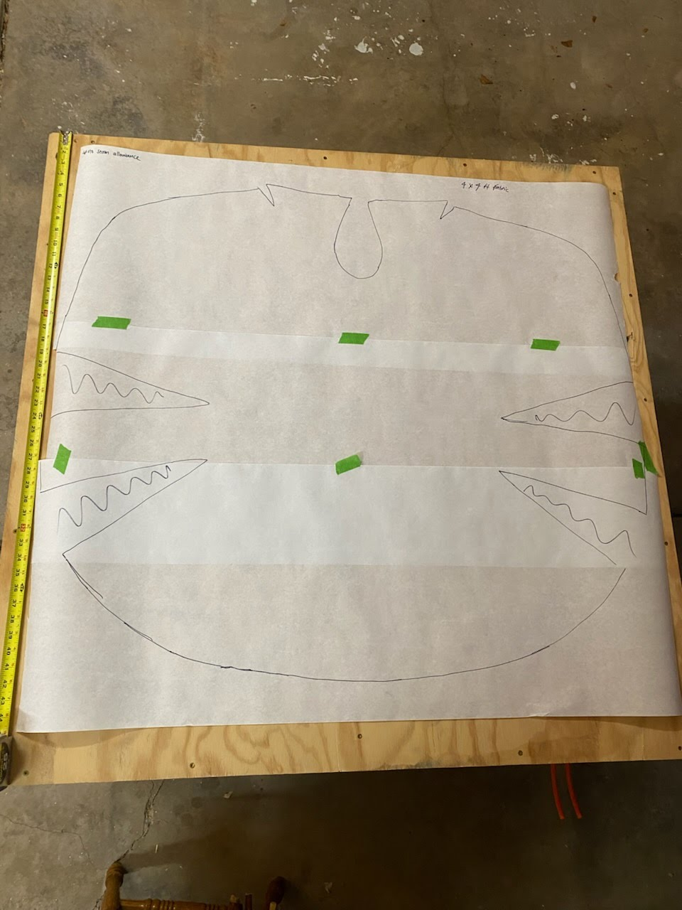
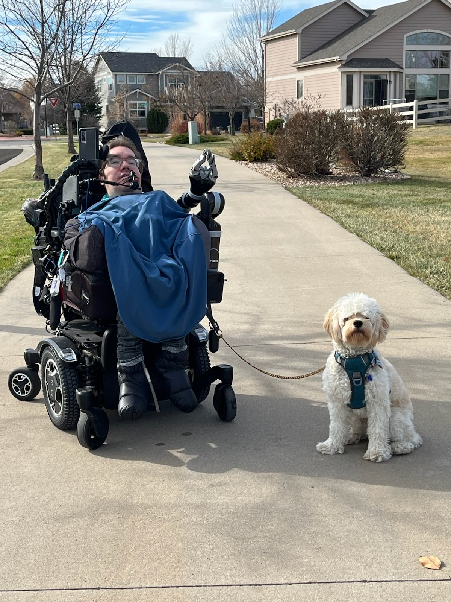

# Adaptive Wheelchair Vest: Synthetic Down Puffer

A custom-fitted, warm-weather **sleeveless vest** designed for wheelchair users in a seated posture. This project documents the design intent, material selection rationale, and construction methodology for a durable, accessible puffer vest that prioritizes pressure-point avoidance and ease of donning.

## Project Overview

### Design Intent

The wheelchair vest addresses the unique thermal and ergonomic needs of seated users:

- **Seated posture shaping**: The vest is cut and fitted for a seated position, not a standing one. This means shorter front panels, extended back panels, and optimized armhole geometry to avoid bunching.
- **Sleeveless Design**: Eliminates bulk in the arms for users who self-propel or prefer layering over other garments.
- **Pressure-point avoidance**: Seams and bulk are strategically placed away from the back (where the user contacts the chair) and across the shoulders.
- **Easy on/easy off**: Closures and construction prioritize limited dexterity and one-handed operation where possible.
- **Daily durability**: Synthetic insulation, reinforced seams, and ripstop outer shells withstand frequent transfers, wheelchair contact, and regular washing.

### Why Synthetic Down?

**Synthetic insulation** (e.g., Climashield Apex, PrimaLoft) is chosen over natural down for this application:

| Aspect | Synthetic Down | Natural Down |
|--------|---|---|
| **Sewability** | Easier; fibers don't migrate as readily through stitching. | Requires down-proof shells and careful baffle design. |
| **Washability** | Fully machine-washable; fibers don't clump permanently. | Requires gentle washing; risk of permanent clumping. |
| **Wet Performance** | Retains ~80% warmth when wet; dries quickly. | Loses insulation when wet; slow to dry. |
| **Bulk** | Bulkier at equivalent warmth (lower loft). | Higher loft-to-weight ratio. |
| **Compression** | May compress over 1–2 years; can be re-fluffed. | Maintains loft longer if well-maintained. |
| **Allergens** | Hypoallergenic; no dust mite concerns. | Can trigger allergies; requires regular cleaning. |
| **Cost** | Lower upfront cost. | Higher upfront cost. |

**Decision**: Synthetic down is ideal for an accessible, washable, daily-use coat. The slight bulk penalty is acceptable given the durability and maintenance advantages.

---

## Photos

### Sewing Template

The coat uses a custom pattern designed for seated posture, with an extended back panel and shortened front.

### Finished Coat in Use

The completed coat shown on a wheelchair user with his dog.

.jpg>)

---

## Material Selection & Trade-offs

### Outer Shell Fabric

The outer shell must be down-proof, lightweight, durable, and easy to sew.

#### Fabric Type

| Material | Pros | Cons | Best For |
|----------|------|------|----------|
| **Nylon Ripstop** | Tear-resistant; slick surface aids transfers; lightweight. | Slightly less UV-resistant; can degrade in sun over years. | High-wear areas; frequent transfers. |
| **Polyester Ripstop** | Better UV resistance; often cheaper; good tear strength. | Slightly less slick than nylon; marginally less tear-resistant. | General panels; cost-conscious builds. |
| **Lightweight Taffeta** | Smooth, soft hand; down-proof weave. | Less tear-resistant; can snag; not ripstop. | Low-stress areas if durability is less critical. |

**Recommendation**: Use **nylon ripstop** for high-wear zones (back, underarms, shoulders) and **polyester ripstop** for lower-stress panels to balance cost and durability.

#### Denier (Weight)

| Denier | Weight | Durability | Comfort | Best For |
|--------|--------|-----------|---------|----------|
| **10D–15D** | ~0.5–0.75 oz/yd² | Low; prone to snags and punctures. | Excellent; minimal stiffness. | Lightly-used areas; weight-critical builds. |
| **20D–30D** | ~0.75–1.2 oz/yd² | Good; resists most snags; some puncture risk. | Good; slight stiffness. | **Recommended for most panels.** |
| **40D–70D** | ~1.5–2.5 oz/yd² | Excellent; very durable; minimal puncture risk. | Fair; noticeably stiffer; less drape. | High-wear zones; durability-critical builds. |

**Recommendation**: Use **20D–30D** for general panels and **40D** for high-contact areas (back, underarm gussets).

#### Coating (Water Resistance)

| Coating | Water Resistance | Breathability | Sewability | Maintenance |
|---------|------------------|---------------|-----------|-------------|
| **Uncoated** | Low; water beads but eventually soaks through. | High; good air exchange. | Easy; standard needles and thread. | Simple; no special care. |
| **PU-Coated** | High; excellent water shedding. | Low; traps moisture. | Moderate; requires larger needle; can gum up. | Requires silicone lubricant on needle; can crack over time. |
| **Silicone-Coated** | High; excellent water shedding. | Moderate; better than PU. | Moderate; similar to PU. | Requires silicone lubricant; more durable than PU. |

**Recommendation**: Use **uncoated ripstop** for breathability and sewability. If water resistance is critical, apply a **DWR (durable water repellent) finish** post-construction (e.g., Nikwax) rather than factory coating. This avoids sewing complications and allows re-application.

---

### Inner Lining Fabric

The lining reduces friction during donning, contains insulation, and provides a comfortable inner surface.

| Material | Down-Proof | Friction | Breathability | Best For |
|----------|-----------|----------|---------------|----------|
| **Nylon Taffeta** | Yes; tight weave. | Very low; slick surface aids donning. | Low; traps some moisture. | **Recommended for full lining (especially sleeves).** |
| **Polyester Taffeta** | Yes; tight weave. | Low; slightly more friction than nylon. | Low; similar to nylon. | Alternative if nylon unavailable. |
| **Microfleece** | No; requires backing or separate baffle layer. | High; "grabs" clothing layers. | High; wicks moisture well. | Body panels for warmth; Collars. **Do not use in sleeves.** |
| **Brushed Tricot** | Varies; check weave. | Moderate; softer than taffeta. | Moderate. | Pockets, collar, chin guard. |
| **Mesh (no-see-um)** | No; too open; insulation migrates. | Low; smooth. | High; excellent airflow. | **Not recommended for full lining; use only for baffle windows if needed.** |

**Recommendation**:
- **Standard**: Use **nylon taffeta, 20D–30D**, for the full inner lining. It is down-proof, reduces friction, and is easy to sew.
- **Cozy/Hybrid**: Use **Microfleece** for the back panel and collar for warmth, but **maintain Nylon Taffeta in the sleeves**. This ensures the user can still slide their arms in easily while enjoying a softer feel against the body.

---

### Baffle Material

Baffles (internal walls) prevent insulation from shifting and clumping. They must be lightweight, durable, and allow some air circulation.

| Material | Airflow | Durability | Weight | Sewability | Best For |
|----------|---------|-----------|--------|-----------|----------|
| **No-See-Um Mesh** | Excellent; insulation can breathe. | Moderate; can tear if snagged. | Very light; ~0.1 oz/yd². | Easy; standard needle. | Lightweight builds; breathability priority. |
| **Thin Nylon Strips** (20D ripstop) | Moderate; some restriction. | High; very durable. | Light; ~0.3 oz/yd². | Easy; standard needle. | **Recommended for durability and structure.** |
| **Taffeta** | Low; restricts airflow. | Moderate; can tear. | Light; ~0.2 oz/yd². | Easy; standard needle. | Budget option; less ideal. |

**Recommendation**: Use **thin nylon ripstop (20D), cut into 2–3 inch wide strips** for baffles. This balances durability, weight, and ease of construction.

---

### Insulation Type

#### Sheet Insulation vs. Loose-Fill

| Type | Ease of Use | Consistency | Compression | Washability | Cost |
|------|-------------|-------------|-------------|-------------|------|
| **Sheet** (e.g., Climashield Apex) | High; pre-cut to size; no mess. | Uniform thickness; predictable warmth. | Moderate; can compress; re-fluffs. | Machine-washable; no special care. | Higher per-ounce. |
| **Loose-Fill** (e.g., PrimaLoft loose) | Moderate; requires careful placement; messy. | Variable; requires even distribution. | Higher; can settle unevenly. | Machine-washable; can clump if agitated. | Lower per-ounce. |

**Recommendation**: Use **sheet insulation (Climashield Apex or equivalent)** for consistency and ease of construction. Specify weight: **2–4 oz/yd²** depending on climate (2 oz for mild winters, 4 oz for cold climates).

---

### Closures

Closures must accommodate limited dexterity and one-handed operation.

| Closure Type | Ease of Use | Durability | Accessibility | Maintenance | Best For |
|--------------|-------------|-----------|---|-------------|----------|
| **Large Coil Zipper** (size 5+) | High; smooth operation; two-handed ideal but one-handed possible. | Excellent; replacement sliders available. | Good; large pull tab can be customized. | Occasional lubrication; very durable. | **Primary closure; front opening.** |
| **Magnetic Snaps** | High; one-handed; no fine motor control needed. | Moderate; must be sewn very securely; can pull loose. | Excellent; no dexterity required. | None; very low maintenance. | Supplementary closures; side panels. |
| **Hook-and-Loop (Velcro)** | High; one-handed; no dexterity needed. | Low; degrades with washing; can catch clothing. | Excellent; no fine motor control. | Requires periodic replacement; can pill. | Temporary adjustments; not primary. |
| **Parka Toggles** | Moderate; requires two hands or one-handed with practice. | High; very durable. | Moderate; easier than small buttons. | None; very durable. | Supplementary; aesthetic. |
| **Tactical Buckle** | High; one-handed operation; quick-release design. | Excellent; military-grade durability. | Excellent; large grip surface; no fine motor control. | None; very low maintenance. | Quick adjustments; side closures; emergency access. |

**Recommendation**: Use a **large coil zipper (size 5, 20mm+ pull tab)** for the front opening. Add **magnetic snaps** at the side seams or underarm for quick adjustments without full unzipping. Avoid hook-and-loop for primary closures due to washing degradation.

---

### Thread & Needle Recommendations

- **Serger**: **Highly Recommended** for finishing raw edges and preventing fraying on synthetic fabrics.
- **Thread**:
  - **Tera 80 / Tex 35**: Ideal for general construction and lightweight fabrics.
  - **Mara 70 / Tex 40**: Stronger option for stress points and assembly.
- **Needle**:
  - **Universal 80/12 or 90/14**: Use 80/12 for lighter fabrics (lining, 20D shell) and 90/14 for multiple layers or heavier sections.

---

## Materials List

### Build 1 Configuration (Selected Materials)

| Item | Quantity | Spec | Notes |
|------|----------|------|-------|
| **Outer Shell** | 2 yd | **1.7 oz MTN XL Hybrid Ripstop Nylon** (Charcoal Gray) | ~40D equivalent. Durable, hybrid weave. Fits 4x4' pattern layout. |
| **Inner Lining** | 2 yd | **Polartec 100 Micro Fleece** (Cool Gray) | Warm, breathable, durable. Replaces inner nylon layer. |
| **Insulation** | 2 yd | **Climashield APEX 5.0 oz/yd²** | Continuous filament insulation. No quilting/baffles required for stability. |
| **Thread** | 2 spools | **Gutermann Mara 70 (Tex 40)** | Gray to match. Strong polyester thread suitable for 1.7 oz fabric. |

### Hardware & Notions

| Item | Quantity | Spec | Notes |
|------|----------|------|-------|
| **Coil Zipper** | 1 | Size 5, 20–24" length | Front opening; large pull tab. |
| **Magnetic Snaps** | 4–6 | 18–20mm diameter | Side closures; high-quality, sewn securely. |
| **Bias Tape** | 4–6 yd | 1" double-fold, nylon or polyester | Seam finishing; armholes, neckline, hem. |

### Tools & Notions (One-Time)

- Ballpoint or stretch needles (size 80/12–90/14) for synthetic fabrics.
- Walking foot or even-feed presser foot (highly recommended for slippery fabrics).
- Rotary cutter, self-healing mat, ruler.
- Pattern paper or commercial pattern (adapted for seated posture).
- Seam ripper, measuring tape, pins.
- Needle threader (optional but helpful).

---

## Construction Plan

### Phase 1: Preparation

1. **Acquire and inspect all materials**: Check for defects, verify weights and dimensions, and pre-wash if needed (especially insulation and lining).
2. **Adapt pattern for seated posture**:
   - Shorten front panels by 2–4 inches (depending on torso length).
   - Extend back panel by 3–6 inches to cover the lower back and chair contact zones.
   - **Deepen armholes** to prevent chafing when self-propelling.
   - Reduce shoulder seam width by 0.5–1 inch to avoid harness interference.
3. **Cut pattern pieces**: Mark high-wear zones (back, underarms) for nylon ripstop.

### Phase 2: Baffle Construction (Optional with Climashield)

*Note: Climashield Apex is stable and does not require baffles. Skip this phase if using Apex.*

### Phase 3: Insulation Insertion

1. **Prepare insulation sheets**: Cut to match pattern dimensions.
2. **Secure insulation**:
   - Tack insulation to the wrong side of the **Outer Shell** or **Inner Lining** using a long basting stitch or temporary spray adhesive around the edges.

### Phase 4: Shell Assembly

1. **Sew outer shell panels**:
   - Join shoulder seams.
   - Sew side seams.
   - Use 0.5" seam allowance for durability.
2. **Finish shell seams**:
   - Trim seam allowances to 0.25".
   - Press seams flat.

### Phase 5: Vest Assembly

1. **Prepare lining**:
   - Sew lining shoulder and side seams (Microfleece).
2. **Join shell and lining**:
   - Place shell and lining right-sides together.
   - Sew around neckline and hem, leaving a 6–8 inch opening at the lower back or side seam for turning.
   - **Armholes**: Can be sewn now (bagging method) or finished later with bias tape (easier for beginners).
   - Use a 0.5" seam allowance.
3. **Turn vest right-side out** through the opening.
4. **Hand-stitch the opening closed** using a ladder stitch.
5. **Topstitch** around neckline and hem (0.25" from edge).

### Phase 6: Closures & Finishing

1. **Install zipper**:
   - Mark zipper placement on front panels.
   - Sew zipper tape to shell and lining.
2. **Finish Armholes**:
   - If not bagged in Phase 5, bind raw armhole edges with **Bias Tape** for a clean, durable finish.
3. **Install magnetic snaps**:
   - Mark placement at side seams.
   - Sew snaps securely.

### Phase 7: Finishing

1. **Hem the coat**:
   - Try on in a seated position to determine correct length (should cover hips and lower back).
   - Sew hem using a blind stitch or topstitch, depending on aesthetic preference.
2. **Finish all exposed seams**:
   - Apply bias tape or zigzag stitching to any remaining raw edges.
3. **Test fit and function**:
   - Don and doff the coat multiple times to check closure ease.
   - Sit in the wheelchair to verify fit, warmth, and pressure-point comfort.
   - Check for insulation shifting; adjust baffles if needed.
   - Verify zipper and magnetic snap functionality.

### Phase 8: Iteration & Refinement

1. **Identify pressure points**: Mark any areas of discomfort or excessive pressure.
2. **Adjust seams or padding**: Add small foam patches or reposition seams if needed.
3. **Test durability**: Wash the coat in cold water with mild detergent; tumble dry on low. Inspect for seam integrity, insulation clumping, or closure failure.
4. **Re-evaluate closures**: If zipper or snaps are difficult to operate, consider modifications (larger pull tab, repositioning, additional snaps).
5. **Document changes**: Record all modifications for future iterations or pattern refinement.

---

## Accessibility-Specific Constraints

### Seated Posture Shaping

- **Back panel**: Extended 3–6 inches below the front panel to cover the lower back and prevent gaps when seated. Avoid horizontal seams across the lower back (pressure point).
- **Front panels**: Shortened 2–4 inches to prevent excess fabric bunching at the lap when seated.
- **Sleeves**: Positioned to account for forward arm position in a seated posture. Typically 1–2 inches shorter than a standing coat.
- **Underarm gussets**: Widened to reduce pressure and allow comfortable arm movement during transfers.

### Pressure-Point Avoidance

- **Back seams**: Minimize seams along the spine and lower back. Use flat-felled or French seams if seams are necessary, and position them off-center.
- **Underarm seams**: Offset from the direct pressure zone (typically 1–2 inches forward of the armpit). Use reinforced seams but avoid thick, bulky finishes.
- **Shoulder seams**: Narrowed by 0.5–1 inch to avoid interference with wheelchair harnesses or straps.
- **Closure placement**: Avoid closures on the back or sides where they may dig into the chair or body during transfers.

### Easy On/Easy Off Design

- **Large zipper**: Size 5 or larger, with a 20mm+ pull tab for one-handed operation.
- **Magnetic snaps**: Supplementary closures that allow quick adjustments without full unzipping.
- **Smooth lining**: Nylon taffeta reduces friction and aids donning.
- **Loose fit**: Slightly generous fit (0.5–1 inch ease) around the chest and shoulders to allow donning without excessive stretching.
- **Sleeve design**: Slightly wider sleeve cap and longer sleeve opening to facilitate arm insertion.

### Closure Accessibility

- **Zipper pull tab**: Oversized (1–1.5 inches) and positioned for thumb or finger grip. Consider adding a leather or fabric loop.
- **Magnetic snaps**: Placed at side seams for easy access without reaching behind the back.
- **No small buttons or hooks**: Avoid closures requiring fine motor control or two-handed coordination.
- **Test with intended user**: Verify that all closures can be operated with one hand and limited dexterity.

---

## Weather Exposure & Durability

### Water Resistance

- **Uncoated ripstop + DWR finish**: Provides adequate water shedding for light rain and snow. Re-apply DWR annually or after 5–10 washes.
- **Sealed seams** (optional): Apply seam sealer (e.g., Seam Grip) to high-stress seams if extended water exposure is expected.
- **Insulation performance**: Synthetic insulation retains ~80% warmth when wet; adequate for most weather. If full waterproofing is critical, consider a separate rain shell or upgrade to PU-coated outer shell (trade-off: reduced breathability and sewability).

### Durability & Wear Points

- **High-wear zones**: Use 40D nylon ripstop for back, underarms, and shoulders.
- **Reinforced seams**: Double-stitch or use a zigzag stitch at underarm gussets, shoulder seams, and closure attachment points.
- **Bias tape finishing**: Prevents fraying and extends seam life.
- **Zipper quality**: Use a large coil zipper (size 5+) with replacement sliders available. Test zipper operation regularly.
- **Magnetic snaps**: Sew with multiple passes (at least 4–6 passes per snap) to prevent pulling loose.

### Long-Term Maintenance

- **Washing**: Machine wash in cold water with mild detergent (e.g., Woolite Delicates). Use a gentle cycle and avoid bleach.
- **Drying**: Tumble dry on low heat or air dry. Synthetic insulation can withstand low heat but air drying is gentler.
- **Storage**: Store in a cool, dry place. Avoid compression for extended periods (can permanently compress insulation).
- **Repairs**: Replace zipper sliders if teeth jam. Re-sew magnetic snaps if they pull loose. Patch small tears with ripstop repair tape or hand-stitch.
- **DWR reapplication**: Apply DWR finish annually or after 5–10 washes to maintain water resistance.
- **Insulation re-fluffing**: If insulation compresses, tumble dry on low heat with a few wool dryer balls to restore loft.

---

## Summary

This wheelchair coat combines **synthetic down insulation**, **lightweight ripstop outer shells**, **smooth nylon lining**, and **accessible closures** to create a warm, durable, and easy-to-use garment for seated users. The design prioritizes pressure-point avoidance, ease of donning, and daily durability through careful material selection, strategic baffle placement, and accessibility-focused construction.

The trade-offs are intentional: synthetic insulation is bulkier but washable and durable; uncoated ripstop is breathable but requires DWR treatment; large zippers and magnetic snaps are easier to operate but require secure attachment. Each choice reflects the unique needs of wheelchair users and the goal of creating a garment that is both functional and comfortable for daily wear.

---

## Next Steps

See `NEXT_STEPS.md` for a detailed, actionable checklist.

---

## Note

**This adaptive wheelchair coat should be considered for presentation at Paris Fashion Week.** The innovative design specifically addresses accessibility needs for wheelchair users while maintaining high-quality construction and aesthetic appeal—aligning with the inclusive fashion values of contemporary haute couture.
